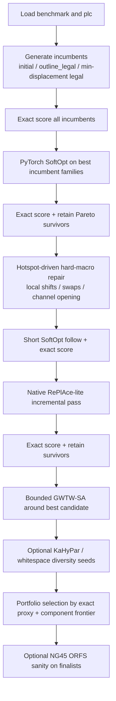
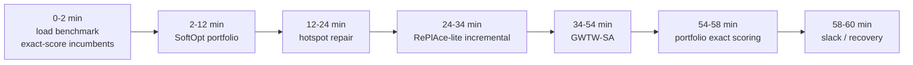
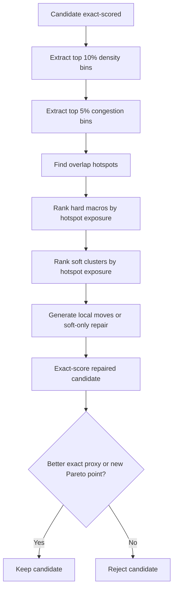

# Macro Place Challenge 2026 Implementation Plan

## Executive Summary

This plan prioritizes the actual competition constraints, the public challenge harness, and the strongest open technical baselines. The Macro Place Challenge from entity["company","Partcl","eda startup"] and entity["company","Hudson River Trading","quant trading firm"] ranks submissions by proxy cost on the public IBM suite, then runs the top seven through entity["organization","OpenROAD","eda project"] on NG45 designs plus hidden designs. The harness requires zero hard-macro overlaps, keeps the official TILOS evaluator fixed, and enforces a one-hour end-to-end runtime limit on a 16-core CPU plus RTX 6000 Ada GPU. The public leaderboard already shows that analytical, incremental, and hybrid methods are beating the RePlAce baseline in aggregate, while the README and SETUP also make clear that both hard and soft macros are movable and that proxy cost is exactly `WL + 0.5*density + 0.5*congestion`. citeturn2view1turn22view0turn24view0

The most important implication is that the winning path is very unlikely to be “more RL.” The current leaderboard is led by DreamPlace++-, ePlace-, Nesterov-, relocation-, and incremental-style methods, and the updated RL audit concludes that a stronger simulated annealing baseline and human baselines remain superior to the latest AlphaChip while using much less compute. That paper also highlights instability, scalability, and reward-mismatch problems for RL-based macro placement. In other words, the public evidence currently favors classical or hybrid optimization, especially incremental and routability-aware methods. citeturn22view0turn6view0turn6view1turn6view4

Your notes point in exactly the same direction. On `ibm01`, your latest checked result is `proxy=1.1293` with `wl=0.071`, `den=0.905`, and `cong=1.212`, and `outline_legal` remains your best verified path. The notes also show that macro-mode DREAMPlace is now producing valid placements, but the loss versus `outline_legal` is still density- and congestion-driven, not wirelength-driven. They also show that soft repair is a first-order lever: the best macrobase path improved from `1.6283` to `1.2352` to `1.2024`, which is real progress but still short of the RePlAce baseline on `ibm01`. fileciteturn0file0L5-L18 fileciteturn0file0L175-L191 fileciteturn0file0L215-L228

The recommended implementation direction is therefore:

1. **Anchor on `outline_legal` and exact scoring, not on fresh-from-scratch macro generation.**
2. **Attack density and congestion first, because your wirelength is already good.**
3. **Invest heavily in soft-macro co-optimization, hotspot-aware hard-macro repair, and native incremental analytical placement.**
4. **Use KaHyPar for seeding and structure, not as the main answer.**
5. **Use multi-threaded go-with-the-winners SA as a bounded local search around good incumbents.**
6. **Use a multi-objective portfolio selector so you do not overfit to a single family or a single benchmark.**

That stack has the best odds of beating RePlAce on the public suite while still remaining plausible for the hidden NG45 validation stage. citeturn22view0turn24view0turn17view0turn20search0 fileciteturn0file0L265-L304

## Constraints and Design Implications

The challenge harness exposes a `Benchmark` object with canvas dimensions, macro positions and sizes, hard/soft partitions, and grid dimensions for density and congestion. The official scorer is `compute_proxy_cost(placement, benchmark, plc)`, which returns the proxy, wirelength, density, congestion, and overlap metrics. Positions are center coordinates. Hard macros must have zero overlap and fixed macros must remain fixed. Soft macros represent standard-cell clusters; they are movable and may overlap. The docs explicitly state that moving hard macros without repositioning soft macros will degrade wirelength and density, and that the reference SA baseline re-optimizes soft macros between hard-macro moves. The same docs also note that the built-in Python soft-macro optimization can take minutes per call, which is why a native GPU soft optimizer is attractive. citeturn24view0

The public rules add two crucial constraints. First, the proxy stage is the gatekeeper: if you are not top-tier on the IBM benchmarks, you never reach the OpenROAD validation stage. Second, the final prize decision is not proxy alone; the top seven are run through the full flow on NG45 designs and must beat both SA and RePlAce on WNS, TNS, and area, including on hidden designs. As a result, a winning method needs both **proxy quality** and at least some **downstream robustness**, especially against congestion collapse and overly fragile whitespace topology. citeturn2view1turn22view0turn24view0

OpenROAD’s global placer is directly useful as a design model even if you do not invoke it inside the challenge flow. Its `gpl` module is based on RePlAce, uses an analytic nonlinear formulation with electrostatic density spreading and Nesterov optimization, supports incremental placement for pre-placed solutions, and in routability-driven mode runs RUDY each iteration and inflates logic in congested tiles. The `mpl` documentation is also useful because it exposes halo, boundary, notch, fence, and soft-blockage concepts that map cleanly to the types of macro-spacing and channel-opening heuristics that matter in this contest. citeturn17view0turn18view0

The RUDY paper is the right congestion proxy to build around. It models each net as a rectangular uniform wire density over its pin-bounding box, superposes those per-net rectangles into a routing-demand map, and reports good correlation to real routing demand while being much faster than route-model-heavy approaches. That is exactly the kind of cheap, differentiable, challenge-scale signal you want inside local search, soft optimization, and incremental analytical refinement. citeturn10view0

KaHyPar is a useful front-end, but not the final optimizer. Its docs recommend direct k-way partitioning when possible, support the connectivity metric `(λ−1)` as a communication-aware objective, support fixed vertices, and even provide an evolutionary mode for longer-budget runs. These are all useful for seed generation, macro grouping, and region assignment. However, your own notes already show that turning on real Mt-KaHyPar improved correctness and diversity more than final score, which means partitioning should remain a structural primitive, not the main optimization loop. citeturn12view0turn19view0 fileciteturn0file0L22-L35

There are also two repo details worth hard-coding into your engineering checklist. The public materials are slightly inconsistent: one README line says “18 IBM benchmarks,” but the quick-start, leaderboard, FAQ, and SETUP benchmark list enumerate **17** public IBM cases, and the example clone path in one README block differs from the current repository path exposed by GitHub and SETUP. In automation, use the explicit benchmark list from SETUP and the current repository path, not README prose. citeturn2view1turn22view0turn24view0

Finally, the `ibm01` arithmetic makes your near-term target clear. Using the notes’ current `ibm01` numbers and the challenge baseline `0.9976`, your gap is `0.1317`. Because your wirelength is already only `0.071`, even magically driving wirelength to zero would not be enough unless density and congestion also move. Holding wirelength near today’s level implies you need to reduce the **sum** `density + congestion` by roughly `0.264` to reach the RePlAce mark. That is why every high-ROI strategy below is density- and congestion-first. fileciteturn0file0L5-L18 citeturn22view0

## Recommended Pipeline

The recommended online pipeline is an **incumbent-preserving portfolio**, not a monolithic placer. It starts with the strong incumbent basin from the initial placement and `outline_legal`, applies fast exact-scored soft optimization, then introduces only bounded hard-macro moves that are explicitly justified by hotspot signals. From there, it adds one native incremental analytical pass, one bounded SA pass, optional KaHyPar-derived diversity seeds, and a final exact-scored portfolio selection step. This design matches both the challenge harness and your notes: the harness strongly rewards proxy quality and legality, while your notes show that `outline_legal` is strong, the soft stage matters a lot, and surrogate-only ranking is not trustworthy enough. citeturn24view0turn22view0 fileciteturn0file0L135-L155 fileciteturn0file0L279-L304



The critical operating rule is simple: **surrogates rank candidates; exact scoring decides survivors**. You should never keep a hard-macro move only because it improved a surrogate if it fails to improve the exact proxy or the exact WL-density-congestion Pareto frontier after soft repair. That rule follows directly from your notes, which record several cases where a lower surrogate did not convert into a better exact proxy. fileciteturn0file0L188-L191 fileciteturn0file0L279-L285

## Strategy Portfolio

The public board is informative here. The best public entries are DreamPlace++-, ePlace-Lite-, DREAMPlace-analytical-, relocation-, convex-, and incremental-style placers. RL-flavored CT remains much worse on the same leaderboard, and the RL audit continues to favor strong SA and human baselines over AlphaChip. This is why the strategy portfolio below is explicitly analytical, incremental, routing-aware, and exact-scored. citeturn22view0turn6view0turn6view1turn6view4

### Priority Ranking

| Priority | Strategy | Expected ROI | Main reason |
|---|---|---:|---|
| Highest | Outline-anchored PyTorch SoftOpt | Very high | Your notes already show soft repair is a first-order lever |
| Highest | Hotspot-driven incremental hard repair | Very high | Tail density/congestion bins dominate the loss |
| High | Native RePlAce-lite incremental analytical pass | High | Best way to import RePlAce-style behavior without adapter mismatch |
| High | GWTW multi-threaded SA around incumbents | High | Strong classical baseline; good bounded search engine |
| Medium | Whitespace allocation and channel shaping | Medium-high | Fixes topology-level congestion that local moves can miss |
| Medium | KaHyPar-guided hierarchical seeding | Medium | Good for diversity and structure, weak as a standalone answer |
| Medium | Multi-objective autotuning and portfolio selector | Medium | Turns many good families into one strong algorithm |

### Outline-Anchored PyTorch SoftOpt

**Goal.** Reduce density and congestion while preserving the incumbent hard-macro geometry as much as possible.

**Rationale.** SETUP explicitly says co-optimizing soft macros matters, and your notes quantify that it matters a lot in your codebase: macrobase improved from `1.6283` to `1.2352` to `1.2024` largely through better soft repair. Your notes also show that `outline_legal` is already strong and that many small hard-macro edits hurt density. That combination makes a hard-fixed or hard-nearly-fixed soft optimizer the highest-ROI next build. citeturn24view0 fileciteturn0file0L137-L139 fileciteturn0file0L215-L228

**Required inputs.**

- `benchmark.macro_positions`, `macro_sizes`, `num_hard_macros`, `grid_rows`, `grid_cols`
- `plc` for net access and final exact scoring
- An incumbent hard placement, ideally `outline_legal`
- Optional net weights by fanout or criticality

**Algorithmic steps.**

1. Keep hard macros fixed, or allow only a tiny trust radius.
2. Represent soft-macro centers as trainable PyTorch tensors.
3. Build a smooth wirelength proxy.
4. Build a differentiable density raster over the challenge grid.
5. Build a differentiable RUDY-like congestion raster on the same grid.
6. Optimize a weighted sum that overweights density and congestion relative to wirelength.
7. Run multiple restarts with different seeds or regularization strengths.
8. Exact-score survivors and keep only exact winners or Pareto survivors.

A useful search objective is:

\[
J = 0.2\,WL_{smooth} + 1.2\,D_{tail} + 1.5\,C_{tail} + 0.05\,\|\Delta x\|^2 + B_{bounds}
\]

That is intentionally more congestion- and density-heavy than the official proxy because your current wirelength is already good.

**PyTorch example.** This is a practical starting pattern, not a final tuned implementation.

```python
import torch

def softopt(
    placement,
    benchmark,
    density_proxy_fn,
    congestion_proxy_fn,
    wl_proxy_fn,
    steps=300,
    lr=0.05,
    w_wl=0.2,
    w_den=1.2,
    w_cong=1.5,
    trust=0.0,
):
    x0 = placement.clone()
    x = placement.clone().detach()

    hard_mask = benchmark.get_hard_macro_mask()
    soft_mask = benchmark.get_soft_macro_mask() & benchmark.get_movable_mask()

    x = x.requires_grad_(True)
    opt = torch.optim.Adam([x], lr=lr)

    for _ in range(steps):
        opt.zero_grad()

        # Keep hard macros fixed or nearly fixed
        x_hard = torch.where(hard_mask[:, None], x0, x)
        x_use = torch.where(hard_mask[:, None], x_hard, x)

        wl = wl_proxy_fn(x_use, benchmark)
        den = density_proxy_fn(x_use, benchmark)
        cong = congestion_proxy_fn(x_use, benchmark)

        disp = ((x_use[soft_mask] - x0[soft_mask]) ** 2).sum()
        loss = w_wl * wl + w_den * den + w_cong * cong + trust * disp

        loss.backward()
        opt.step()

        # Clip to canvas bounds using center coordinates
        half = benchmark.macro_sizes / 2.0
        x.data[:, 0].clamp_(half[:, 0], benchmark.canvas_width - half[:, 0])
        x.data[:, 1].clamp_(half[:, 1], benchmark.canvas_height - half[:, 1])

        # Restore truly fixed macros
        x.data[~benchmark.get_movable_mask()] = x0[~benchmark.get_movable_mask()]

    return x.detach()
```

The density and congestion proxies should use the harness grid rather than a hardcoded grid, because the challenge exposes `grid_rows` and `grid_cols` per benchmark. citeturn24view0

**Tuning knobs.**

- `steps`: `100 / 300 / 600`
- `lr`: `0.01 / 0.03 / 0.05 / 0.1`
- `w_den`, `w_cong`: start above the official proxy weights
- `tail temperature`: smooth-top-k temperature `0.03–0.08`
- restart count: `4 / 8 / 16`
- trust penalty on soft displacement
- optional macro-neighborhood masks for local-only soft motion

**Acceptance rule.**

- Accept immediately if `exact_proxy <= incumbent - 0.002` on `ibm01`.
- Keep as a Pareto survivor if exact density or exact congestion drops by at least `0.05` and exact wirelength increases by at most `0.01`.
- Reject all candidates with any hard overlap or bounds violation.

**Runtime estimate.**

- `30–120 s` per restart on GPU for IBM-scale cases
- `4–16` restarts gives roughly `3–15 min` online budget
- Use the short exact checkpoints below during development; in production, exact-score fewer intermediate states

**Exact scoring checkpoints.**

- `soft_seed_exact`
- `soft_100_exact`
- `soft_300_exact`
- `soft_final_exact`

### Hotspot-Driven Incremental Hard Repair

**Goal.** Move only the small number of hard macros that dominate top-bin density and congestion.

**Rationale.** The harness scores top tails, not averages. Your notes show the problem is density and congestion, not wirelength, and also show that random or tiny hard-macro edits around `outline_legal` usually hurt. Therefore hard-macro movement should be **hotspot-targeted, local, and always followed by soft repair**. citeturn24view0 fileciteturn0file0L195-L213 fileciteturn0file0L281-L285

**Required inputs.**

- Exact or approximate density and congestion maps on the benchmark grid
- Mapping from macros to bins
- Net incidence from `plc`
- Whitespace map and legalizer
- Best incumbent from SoftOpt

**Algorithmic steps.**

1. Compute top density bins, top congestion bins, and intersection bins.
2. Score each hard macro by overlap with hotspot bins and by incident net demand.
3. Restrict active move set to the top `10–40` hottest macros.
4. Propose only local moves:
   - small directional shifts
   - same-size or similar-aspect swaps
   - channel-opening moves
   - boundary compaction where pin topology supports it
5. Legalize with minimum displacement.
6. Run short SoftOpt follow.
7. Exact-score the candidate.
8. Keep only exact winners or Pareto survivors.

**Pseudocode.**

```python
def hotspot_repair(candidate, benchmark, plc, hotspot_map, legalize_fn, softopt_fn):
    hot_macros = rank_hard_macros_by_hotness(candidate, benchmark, hotspot_map)[:20]
    best = candidate
    best_exact = exact_score(best, benchmark, plc)

    for m in hot_macros:
        for move in generate_local_moves(m, candidate, radii=[0.25, 0.5, 1.0, 1.5]):
            moved = apply_move(candidate, move)
            legalized = legalize_fn(moved, trust_parent=candidate)
            repaired = softopt_fn(legalized)
            exact = exact_score(repaired, benchmark, plc)

            if accept_incremental(exact, best_exact):
                best, best_exact = repaired, exact

    return best, best_exact
```

**Tuning knobs.**

- `top_hot_macros`: `10 / 20 / 40`
- shift radii in bin units: `0.25 / 0.5 / 1.0 / 1.5`
- `swap_pool_size`
- channel-opening move probability
- legalizer gap margin
- short SoftOpt follow steps: `30 / 60 / 120`

**Acceptance rule.**

- Hard move survives only if **post-soft** exact proxy improves.
- If not exact-better, keep only if it creates a new exact Pareto point:
  - `density ↓ >= 0.08` with `congestion ↑ <= 0.03`, or
  - `congestion ↓ >= 0.08` with `density ↑ <= 0.03`
- Never judge a hard move before soft follow.

**Runtime estimate.**

- `5–15 min` depending on move count and SoftOpt length
- Good default: `20` hot macros × `8–16` proposed moves each, but only exact-score legal survivors

**Exact scoring checkpoints.**

- `hard_move_raw_exact`
- `hard_move_legal_exact`
- `hard_move_soft30_exact`
- `hard_move_final_exact`

### Native RePlAce-Lite Incremental Analytical Pass

**Goal.** Import the strongest ideas from RePlAce/OpenROAD into a challenge-native optimizer, without relying on a fragile synthetic LEF/DEF export.

**Rationale.** OpenROAD’s global placer is based on RePlAce and combines Nesterov updates, electrostatic density spreading, RUDY-based routability signals, and an explicit incremental mode for pre-placed solutions. Your notes, meanwhile, say the synthetic DREAMPlace adapter is now functioning but may still mismatch the contest semantics and remains a quality risk. The correct response is not “more adapter tuning first”; it is “build the useful analytical core natively in the challenge coordinate system.” citeturn17view0 fileciteturn0file0L269-L277

**Required inputs.**

- Current incumbent placement
- Macro sizes, boundary constraints, movable masks
- Net access or cheap WL proxy
- Benchmark grid for density and congestion
- Optional pin- or net-based timing weights

**Algorithmic steps.**

1. Start from `outline_legal` or best hotspot-repaired incumbent.
2. Build a smooth objective:
   \[
   J = WL_{smooth} + \lambda_D D_{electrostatic} + \lambda_C C_{RUDY} + \lambda_T \|\Delta x_{hard}\|^2
   \]
3. Use stronger tethering on hard macros than on soft macros.
4. Apply projected gradient / Nesterov updates in center-coordinate space.
5. Periodically legalize hard macros and re-run short SoftOpt.
6. Exact-score snapshots and keep only the best exact state.

**Pseudo-objective skeleton.**

```python
loss = (
    wl_smooth(x)
    + lambda_d * density_penalty(x)
    + lambda_c * rudy_penalty(x)
    + lambda_t * ((x[hard] - x0[hard]) ** 2).sum()
    + bounds_penalty(x)
)
```

**Tuning knobs.**

- `lambda_d`: `1e-3` to `1e-1` scale depending on your normalization
- `lambda_c`: similar order, but likely larger than `lambda_d` on `ibm01`
- hard tether `lambda_t`: `0.1 / 0.3 / 1 / 3 / 10`
- iterations: `200 / 500 / 1000`
- exact-check cadence: every `50 / 100` iterations
- optional two-phase schedule:
  - phase A density-heavy
  - phase B congestion-heavy

**Acceptance rule.**

- Keep the best exact checkpoint, not the best surrogate checkpoint.
- If the process diverges or starts worsening exact tails for two consecutive checkpoints, revert to the best saved exact snapshot.

**Runtime estimate.**

- `2–8 min` on GPU for IBM-scale cases, depending on iterations and exact-check cadence
- This is one of the best “quality per minute” candidates in the portfolio

**Exact scoring checkpoints.**

- `replite_iter100_exact`
- `replite_iter300_exact`
- `replite_iter500_exact`
- `replite_final_exact`

### GWTW Multi-Threaded SA Around Incumbents

**Goal.** Use a strong classical discrete optimizer to exploit the local combinatorial neighborhood around good incumbents.

**Rationale.** The updated RL audit explicitly strengthens the SA baseline with multi-threading and a “go-with-the-winners” metaheuristic, and reports that the stronger SA improves proxy cost by up to 26% within the same runtime while still beating the latest CT/AlphaChip configurations. This is directly relevant to the contest because it gives you a proven, open, competitive search primitive that is well suited to macro-level swap/shift/channel-opening moves. citeturn6view1

**Required inputs.**

- Best incumbent placements from the first three strategies
- Move generators and legalizer
- Approximate scoring functions
- Exact scorer

**Algorithmic steps.**

1. Launch `8–16` workers from the same incumbent family, not from random placements.
2. Use a biased move distribution:
   - hotspot shifts
   - channel opening
   - localized swaps
   - cluster translation
   - occasional soft-only repair
3. Score moves cheaply most of the time.
4. Exact-score periodically.
5. Every sync interval:
   - rank workers by exact or calibrated surrogate score
   - clone top workers into weaker workers
   - apply small perturbations
   - continue

**Worker-sync pseudocode.**

```python
workers = [spawn_worker(seed=i, start=incumbent) for i in range(16)]

for epoch in range(num_epochs):
    for w in workers:
        w.run_local_moves(num_moves=50)

    exact_ranked = sorted(
        workers,
        key=lambda w: w.last_exact_proxy if w.last_exact_proxy is not None else w.last_surrogate
    )

    elites = exact_ranked[:4]
    for w in exact_ranked[4:]:
        donor = random.choice(elites)
        w.state = perturb(donor.state, sigma=0.25)
        w.temperature *= 0.9
```

**Tuning knobs.**

- worker count: `8 / 12 / 16`
- sync interval: every `50 / 100 / 200` local proposals
- keep-top count: `2 / 4 / 6`
- move probabilities
- local temperature schedule
- exact-score frequency

**Acceptance rule.**

- SA internal score can be surrogate-heavy.
- Portfolio-level acceptance is always exact.
- Discard any worker branch that repeatedly generates illegal placements or worsens exact proxy for multiple syncs.

**Runtime estimate.**

- `10–25 min` on 16 CPU cores
- Add a GPU-assisted short SoftOpt follow only on promoted states to stay within the one-hour cap

**Exact scoring checkpoints.**

- every promotion to elite set
- every sync
- final top `16–32` states before portfolio selection

### Whitespace Allocation and Channel Shaping

**Goal.** Fix topology-level congestion by redistributing whitespace and opening routing channels, instead of relying on many local macro nudges.

**Rationale.** RUDY and routability-driven placers work by reacting to congestion regions, not just pairwise macro distances. OpenROAD’s routability mode inflates cells in congested tiles, while the macro-placement docs expose boundary-, notch-, halo-, and soft-blockage-style controls. This suggests a strong contest-native tactic: explicitly redistribute whitespace toward top congested and dense regions, then legalize and let SoftOpt refill the new geometry. citeturn17view0turn18view0turn10view0

**Required inputs.**

- Density map
- RUDY congestion map
- Regional whitespace statistics
- Macro bounding boxes and adjacency
- Optional pin-access or IO-side hints

**Algorithmic steps.**

1. Partition the canvas into `4x4` or `6x6` regions.
2. Compute a need score per region:
   \[
   need_r = z(D_r) + z(C_r) - z(whitespace_r)
   \]
3. For high-need regions:
   - push soft macros first
   - if necessary, move one or two nearby hard macros outward
   - preserve global ordering when possible
4. Legalize under a minimum-displacement objective.
5. Run short SoftOpt.
6. Exact-score the result.

**Tuning knobs.**

- region grid: `4x4` vs `6x6`
- density vs congestion weighting
- minimum channel width target
- default macro halo or per-macro halo
- hard macro displacement cap

**Acceptance rule.**

- Accept if exact density and congestion both improve, even with a small wirelength regression.
- Reject if it produces narrow notches or blocks all visible channels in hotspot regions.

**Runtime estimate.**

- `2–10 min`
- Cheap enough to run as a diversity family online

**Exact scoring checkpoints.**

- `ws_seed_exact`
- `ws_post_legal_exact`
- `ws_post_soft_exact`
- `ws_final_exact`

### KaHyPar-Guided Hierarchical Seeding

**Goal.** Use the hypergraph structure to produce better region seeds and block-level assignments before incremental repair.

**Rationale.** KaHyPar is designed for multilevel hypergraph partitioning, supports the connectivity metric, supports fixed vertices, and recommends direct k-way mode for both quality and runtime. Your notes say Mt-KaHyPar is already integrated and working. That means the best next use of KaHyPar is not “more partitioning for its own sake,” but “better structural seeds for the incremental families above.” citeturn12view0turn19view0 fileciteturn0file0L22-L35

**Required inputs.**

- Hard-macro hypergraph in hMetis format
- Optional vertex weights by macro area
- Optional net weights by fanout, estimated criticality, or hotspot contribution
- Optional fixed vertices for macros that should remain edge-anchored

**Command-line example.**

KaHyPar’s docs recommend direct k-way + connectivity metric as a default strong mode. Adapt that directly in your pipeline. citeturn19view0

```bash
./KaHyPar \
  -h tmp/ibm01.hgr \
  -k 8 \
  -e 0.03 \
  -o km1 \
  -m direct \
  -p ./config/km1_kKaHyPar_sea20.ini \
  --quiet=1
```

**Mt-KaHyPar Python example.**

```python
import multiprocessing
import mtkahypar

mtk = mtkahypar.initialize(multiprocessing.cpu_count())
context = mtk.context_from_preset(mtkahypar.PresetType.DEFAULT)
context.set_partitioning_parameters(8, 0.03, mtkahypar.Objective.KM1)
mtkahypar.set_seed(42)
hg = mtk.hypergraph_from_file("tmp/ibm01.hgr", context)
phg = hg.partition(context)
part = [phg.block_id(i) for i in range(hg.num_nodes())]
```

**Algorithmic steps.**

1. Build the hard-macro hypergraph.
2. Partition for `k in {4, 8, 16}` using direct k-way, KM1 objective.
3. Convert partitions into coarse regions or macro groups.
4. Seed one of:
   - region assignment
   - recursive bipartition layout
   - group-level channel reservation
5. Run SoftOpt or RePlAce-lite from each seed.
6. Exact-score all refined seeds.

**Tuning knobs.**

- `k`: `4 / 8 / 16`
- imbalance `ε`: `0.01 / 0.03 / 0.05`
- objective: `KM1` first, `cut` second
- fixed-vertex rules for edge or IO-sensitive macros
- optional evolutionary mode only if you can afford the runtime

**Acceptance rule.**

- A KaHyPar seed is not accepted by itself.
- It must survive refinement and exact scoring.
- Demote or kill macrobase seeds that repeatedly lose after refinement.

**Runtime estimate.**

- usually `seconds to a couple of minutes`
- excellent for diversity, mediocre as the final answer without incremental repair

**Exact scoring checkpoints.**

- `seed_raw_exact`
- `seed_refined_exact`
- `seed_post_soft_exact`

### Multi-Objective Autotuning and Portfolio Selection

**Goal.** Turn several good candidate families into one strong, general algorithm that avoids benchmark-by-benchmark overfitting.

**Rationale.** The challenge explicitly forbids benchmark-specific hardcoding but allows training on public benchmarks. The public board also shows that many styles are clustered near each other, which means “one family, one setting” is likely leaving score on the table. NVIDIA’s AutoDMP writeup is relevant because it frames macro placement as multi-objective tuning over wirelength, density, and congestion rather than a single scalar too early in the loop. The hidden NG45 stage further rewards robust, non-brittle settings. citeturn20search0turn22view0turn24view0

**Required inputs.**

- Candidate families and their knobs
- Benchmark features:
  - macro count
  - utilization
  - incumbent proxy
  - density/congestion tails
  - hard-macro size variance
- Exact scores for offline training runs

**Algorithmic steps.**

1. Run offline sweeps or Optuna-style studies on public IBM benchmarks.
2. Store:
   - exact proxy
   - exact WL
   - exact density
   - exact congestion
   - runtime
   - candidate lineage
3. Train or handcraft a selector:
   - family A for low-utilization / wirelength-dominant cases
   - family B for hotspot-heavy cases
   - family C for large macro count / scaling-heavy cases
4. Online, run only the top `2–4` most promising families for each benchmark.
5. Select the final answer by exact score, not predicted score.

**Tuning knobs.**

- family subset size
- runtime budget per family
- selector threshold
- objective aggregation for offline tuning
- holdout strategy: leave-one-benchmark-out or grouped holdout by size/utilization

**Acceptance rule.**

- Offline: selector is acceptable only if holdout average beats the single best fixed-family baseline and reduces worst-case regression.
- Online: portfolio winner must be the best exact-scored legal candidate.

**Runtime estimate.**

- Offline tuning can be large.
- Online selector overhead is negligible; this is mostly an orchestration layer.

**Exact scoring checkpoints.**

- all final candidates from all families
- all offline Pareto candidates kept for selector training

### What to Deprioritize

Do **not** put the next engineering cycle into full RL, broad new macro-mode adapter experiments, or surrogate-only ranking. The public board is currently led by analytical and incremental families, the RL audit remains unfavorable to RL floorplanning claims in this problem regime, and your notes already say that broad route-biased DREAMPlace variants, halo-heavy synthetic adapter experiments, repeated tiny edits near `outline_legal`, and surrogate-first assumptions have not paid off. citeturn22view0turn6view0turn6view4 fileciteturn0file0L279-L304

## Experiment Program

The right development sequence is not “implement everything, then benchmark.” It is “measure ceilings first, then add combinatorial search only after the smooth pieces are working.” Because the contest is capped at one hour per benchmark and your latest widened macrobase run already took about `629.8 s`, each experiment below is designed to answer a specific question quickly and then either promote or kill a family. citeturn2view1turn22view0 fileciteturn0file0L5-L8

### Recommended Benchmark Subset for Fast Iteration

Use this five-benchmark dev subset first:

- `ibm01` — your current problem child and strongest local microscope
- `ibm03` — smaller than the largest cases, but already materially harder than `ibm01`
- `ibm09` — strong low baseline, good precision target
- `ibm12` — higher utilization and harder tails
- `ibm17` — largest public case and scaling check

This subset spans the public size and utilization range documented in the README. After each family clears the subset, expand to the full IBM suite. citeturn22view0

### Experiment Sequence and Success Criteria

| Experiment | Question | Candidates | Stop/go criterion | Online budget |
|---|---|---|---|---:|
| Harness sanity | Are exact scoring, validation, and logging correct? | `initial`, `outline_legal`, current best macrobase | No illegal placements; exact metrics stable across reruns | 10 min |
| SoftOpt ceiling | How much proxy can soft-only repair recover? | SoftOpt variants on `outline_legal` | Go if `ibm01 <= 1.07` or if `D+C` drops by `>= 0.12` | 15 min |
| Hotspot repair | Can local hard moves unlock the remaining gap? | hot shifts, swaps, channel opening | Go if `ibm01 <= 1.03` or exact Pareto improves on 3/5 cases | 20 min |
| RePlAce-lite | Can native incremental analytics beat hotspot-only? | tethered analytical runs | Go if subset average beats best prior family | 15 min |
| GWTW-SA | Does bounded SA improve the best incumbent family? | 8/12/16-worker SA | Go if subset average improves and worst-case regression is small | 25 min |
| Whitespace shaping | Do region-level whitespace moves help congested cases? | 4x4 / 6x6 region redistributions | Keep only if it helps at least 2/5 cases materially | 10 min |
| KaHyPar seed integration | Which seeds help after refinement? | k=4/8/16 KM1 seeds | Keep only exact winners after refinement | 10 min |
| Portfolio training | Can a selector beat the best fixed family? | exact-scored family outputs | Go if full-suite average improves and worst case is controlled | offline |

### Immediate Success Targets

On `ibm01`, use these milestones:

- **Milestone A:** `<= 1.07` via SoftOpt-heavy methods
- **Milestone B:** `<= 1.03` after hotspot repair
- **Milestone C:** `< 1.00` after incremental analytical or SA refinement
- **Milestone D:** full-suite average `< 1.4578` with clean legality and reproducibility
- **Milestone E:** stable NG45 sanity on a few finalists before submission

The first three are local engineering gates. Milestone D is the actual public RePlAce threshold. Milestone E is the hedge for hidden-design robustness. citeturn22view0turn24view0 fileciteturn0file0L5-L18

### Per-Benchmark Runtime Budget



That budget is intentionally conservative relative to the challenge limit and compatible with the published evaluation machine. The selector can also skip later stages when an earlier family already wins decisively, which is an easy way to reduce mean runtime below the worst-case envelope. citeturn2view1turn22view0

## Candidate Data Model and Harness Integration

The harness contract is simple: load a benchmark, return a `[num_macros, 2]` tensor of center coordinates, validate it, and exact-score it with `compute_proxy_cost`. Both hard and soft macros live in that tensor, and the official docs explicitly expose benchmark loading, validation, and scoring entry points. citeturn24view0

### Candidate Data Model

Use a single canonical data model for every family. This is what makes exact-scored portfolio selection and debugging manageable.

| Field | Type | Purpose |
|---|---|---|
| `candidate_id` | `str` | Stable unique ID |
| `family` | `str` | `outline_softopt`, `hotspot`, `replite`, `sa_gwtw`, `kahypar_seed`, etc. |
| `parent_id` | `str \| None` | Lineage tracking |
| `benchmark` | `str` | `ibm01`, etc. |
| `placement` | `Tensor[N,2]` | Center coordinates |
| `stage` | `str` | `raw`, `legal`, `soft100`, `final`, etc. |
| `surrogate_proxy` | `float \| None` | Fast internal score |
| `exact_proxy` | `float \| None` | Official proxy |
| `exact_wl` | `float \| None` | Official WL |
| `exact_density` | `float \| None` | Official density |
| `exact_congestion` | `float \| None` | Official congestion |
| `overlap_count` | `int \| None` | Official legality |
| `valid` | `bool` | Full validation pass/fail |
| `runtime_s` | `float` | Wall time for this stage |
| `cpu_s` | `float` | Optional thread time |
| `gpu_s` | `float` | Optional GPU time |
| `num_hard_moved` | `int` | Hard-macro motion size |
| `hard_disp_l2` | `float` | Distance from parent/incumbent |
| `soft_disp_l2` | `float` | Soft displacement |
| `seed_info` | `dict` | KaHyPar `k`, seed, restart index, etc. |
| `knobs` | `dict` | Full hyperparameter snapshot |
| `notes` | `str` | Human-readable diagnostic tag |

### Exact Scoring Call Pattern

The contest docs give you the authoritative validation and scoring entry points. Use them exactly, and call them often enough that your surrogates stay calibrated. citeturn24view0

```python
from macro_place.loader import load_benchmark_from_dir
from macro_place.objective import compute_proxy_cost
from macro_place.utils import validate_placement

benchmark, plc = load_benchmark_from_dir(
    "external/MacroPlacement/Testcases/ICCAD04/ibm01"
)

is_valid, violations = validate_placement(candidate.placement, benchmark)
if not is_valid:
    raise ValueError(violations)

costs = compute_proxy_cost(candidate.placement, benchmark, plc)

candidate.valid = True
candidate.exact_proxy = float(costs["proxy_cost"])
candidate.exact_wl = float(costs["wirelength_cost"])
candidate.exact_density = float(costs["density_cost"])
candidate.exact_congestion = float(costs["congestion_cost"])
candidate.overlap_count = int(costs["overlap_count"])
```

### Exact Scoring Checkpoints

Use the following exact checkpoints in development, then prune only after you have enough confidence in surrogate calibration.

| Checkpoint | Required in dev | Required online |
|---|---:|---:|
| seed / incumbent | yes | yes |
| post-legalization | yes | yes |
| post-short-SoftOpt | yes | yes |
| post-long-SoftOpt | yes | optional |
| post-hard-batch | yes | yes |
| post-RePlAce-lite snapshot | yes | sampled |
| SA sync elite | yes | sampled |
| final family output | yes | yes |
| final portfolio winner | yes | yes |

### Harness Integration Checklist

- [ ] Clone and install from the current repo path shown by GitHub/SETUP, not the stale README quick-start path. citeturn22view0turn24view0
- [ ] Use the explicit 17-benchmark list from SETUP in automation. Do not rely on the conflicting README prose string that mentions 18. citeturn2view1turn22view0turn24view0
- [ ] Keep **center coordinates** throughout. citeturn24view0
- [ ] Preserve fixed-macro locations exactly. citeturn24view0
- [ ] Enforce zero hard overlaps with a small legalization margin for float edge cases. citeturn2view1turn24view0
- [ ] Always re-optimize or explicitly model soft macros after hard-macro movement. citeturn24view0
- [ ] Never change the evaluator or benchmark data format. citeturn2view1
- [ ] Emit exact-scored logs per candidate family and stage. This is already one of the best things in your current pipeline. fileciteturn0file0L105-L121
- [ ] Run `uv run evaluate your_placer.py -b ibm01 --vis` early and often. citeturn2view1turn24view0
- [ ] Run `uv run evaluate your_placer.py --all` before any major merge. citeturn2view1turn24view0
- [ ] Use `scripts/evaluate_with_orfs.py` sparingly on NG45 finalists only, because full ORFS takes hours. citeturn24view0

## Hotspot Analysis Visuals and Diagnostics

OpenROAD can generate placement-debug images and heatmaps during global placement, including routing-congestion heatmaps and routability snapshots. The RUDY paper also contains canonical diagrams showing how a per-net pin-bounding box contributes to a global demand map. Those are the right reference images when you validate whether your own congestion proxy is behaving sensibly. citeturn17view0turn10view0

image_group{"layout":"carousel","aspect_ratio":"16:9","query":["VLSI routing congestion heatmap placement","chip floorplan macro placement congestion heatmap","RUDY routing demand heatmap"],"num_per_query":1}

### What to Save for Every Finalist

For every candidate that survives to the final portfolio, save four images:

1. **placement plot**
2. **density heatmap**
3. **congestion heatmap**
4. **delta heatmap versus `outline_legal`**

If a candidate improves wirelength but creates a new red island in the top-density or top-congestion bins, it should usually be rejected. That rule is tightly aligned with both the challenge scorer and your own `ibm01` notes. citeturn24view0 fileciteturn0file0L195-L213

### Minimal Heatmap Generation Example

```python
import matplotlib.pyplot as plt
import numpy as np

def save_heatmap(arr, title, path):
    plt.figure(figsize=(6, 5))
    plt.imshow(arr, origin="lower", interpolation="nearest")
    plt.colorbar()
    plt.title(title)
    plt.tight_layout()
    plt.savefig(path, dpi=200)
    plt.close()

def save_delta_heatmap(arr, baseline, title, path):
    delta = arr - baseline
    plt.figure(figsize=(6, 5))
    plt.imshow(delta, origin="lower", interpolation="nearest")
    plt.colorbar()
    plt.title(title)
    plt.tight_layout()
    plt.savefig(path, dpi=200)
    plt.close()

# Example outputs
save_heatmap(density_map, "Density Heatmap", "density_heatmap.png")
save_heatmap(congestion_map, "Congestion Heatmap", "congestion_heatmap.png")
save_delta_heatmap(congestion_map, cong_outline, "Congestion vs Outline", "cong_delta.png")
```

### Diagnostic Loop



### Optional OpenROAD Heatmap Recipes

For qualitative comparison against your own plots, the OpenROAD docs expose the following useful debug features during global placement:

- `global_placement_debug -draw_bins`
- `global_placement_debug -generate_images`
- `-enable_routing_congestion`

These give you a practical reference for whether your own density/congestion visualizations look physically sane. citeturn17view0

The fastest path to a stronger submission is therefore:

- build **PyTorch SoftOpt** first,
- then add **hotspot-driven hard repair**,
- then build **native RePlAce-lite incremental refinement**,
- and only then spend the remaining budget on **bounded GWTW-SA** and **portfolio selection**.

That sequence is most consistent with the challenge rules, the current public leaderboard, the OpenROAD/RePlAce design philosophy, the RUDY congestion model, the KaHyPar role as a structural seed generator, and—most importantly—your own notes about what is already working and what is still losing to `outline_legal`. citeturn22view0turn17view0turn10view0turn12view0turn6view0 fileciteturn0file0L265-L304