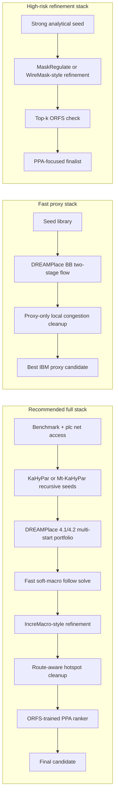
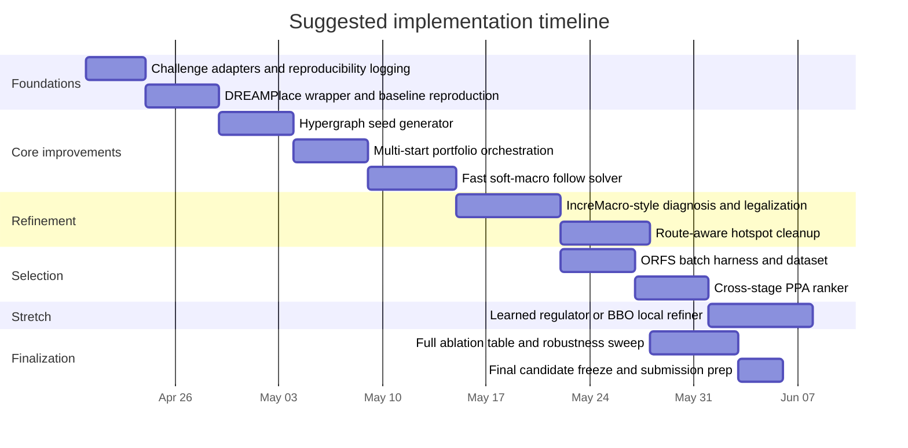

# Winning the Macro Place Challenge 2026

## Executive summary

The challenge organized by entity["company","Partcl","eda startup"] and entity["company","Hudson River Trading","quant trading firm"] has a two-level structure that should drive the entire solution design. Tier 1 ranks submissions by average proxy cost on 17 IBM ICCAD04 benchmarks; Tier 2 takes the top proxy submissions and evaluates them through a full flow on four public NG45 designs plus 1–2 hidden designs, with the grand-prize criterion being better WNS, TNS, and Area than both the SA and RePlAce baselines. The proxy is not arbitrary: it is explicitly `1.0 × wirelength + 0.5 × density + 0.5 × congestion`, with zero overlaps required. citeturn34view0turn7view0

The strongest evidence says the highest-probability path is **not** RL-from-scratch. Public leaderboard results already show that analytical/GPU families are dominating the current proxy race: DreamPlace++ is at 1.3170 average proxy cost, RipPlace at 1.3241, and even a plain “DREAMPlace Analytical” entry is at 1.4076, all below the RePlAce baseline of 1.4578. Meanwhile, the updated public assessment of Circuit Training/AlphaChip reports that a strengthened SA baseline often matches or beats CT on proxy and routed wirelength while using dramatically less compute, and RL pretraining remains extremely resource-intensive. citeturn34view0turn26view0

The best practical route is therefore a **hybrid analytical portfolio**: use a strong GPU analytical backbone such as DREAMPlace 4.1.0-style macro placement, seed it with hypergraph partitioning, co-optimize soft macros aggressively, apply IncreMacro-style post-refinement, add a lightweight routing-aware congestion shaper, and finally rank candidates with a cross-stage PPA selector trained from local OpenROAD-flow-scripts runs. That stack most directly matches the challenge’s actual scoring, the public leaderboard, and the recent literature on end-to-end chip-quality misalignment. citeturn22view0turn36view0turn16search1turn32view0turn40view1turn14view1

If the goal is specifically to **beat RePlAce with high probability**, my ranking is:  
**first**, partition-seeded multi-start DREAMPlace plus AutoDMP-style tuning;  
**second**, IncreMacro-style incremental refinement;  
**third**, a route-aware local congestion-refinement loop;  
**fourth**, a learned cross-stage candidate ranker;  
**fifth**, a fast custom soft-macro follow solver;  
**sixth**, only then, a learned regulator or black-box refiner on top of already-strong seeds. citeturn34view0turn36view0turn16search1turn32view0turn40view1turn20view0

## Challenge mechanics and design implications

The evaluator inherited from entity["organization","TILOS AI Institute","eda research institute"] exposes a `Benchmark` dataclass and a `PlacementCost` object. The benchmark already contains canvas dimensions, hard/soft macro counts, positions, sizes, fixed-mask, grid dimensions, and index maps. Your placer must return a tensor of shape `[num_macros, 2]` containing center coordinates. Importantly, both hard and soft macros are described as movable, and the setup notes that moving hard macros without repositioning soft macros will degrade wirelength and density. This is a major challenge-specific clue: any serious method must either optimize soft macros jointly or at least “follow” hard-macro changes quickly. citeturn7view0

The challenge’s proxy function is unusually informative. It does not use a hidden scoring network; it combines normalized HPWL, top-10%-cell density, and top-5% routing congestion with fixed weights. That means the contest strongly rewards methods that manage **tail behavior** in density and congestion, not just average wirelength. This is exactly why a good solution cannot stop at “faster RePlAce”: it must reduce hotspots and dead-space patterns that later hurt routing and timing. citeturn7view0

The public problem sizes are also large enough that full end-to-end evaluation must be used selectively. Tier 1 spans 17 IBM benchmarks with roughly 246–537 macros and 43%–53% utilization. Tier 2 uses NG45 designs `ariane133`, `ariane136`, `mempool_tile`, and `nvdla`, and the provided ORFS wrapper takes about 3–8 hours per design for a full run. The README explicitly says practical runtime matters and that “< 5 minutes ideal” is a useful target for the placement stage. These facts argue for a two-level search: very fast broad exploration on proxy, then expensive but sparse end-to-end evaluation on only a small set of promising candidates. citeturn34view0turn7view0

One subtle implementation risk deserves explicit attention. The setup page says validation checks “zero macro-to-macro overlaps,” but the placer-writing section also says “zero hard macro overlaps required” and suggests soft macros may overlap because they abstract standard-cell clusters. Those two statements are not perfectly aligned. Until the exact validator path is confirmed in code, the safe engineering assumption is to avoid all overlaps, or at minimum to ensure that any intentional soft overlap never reaches the submission path unchecked. citeturn7view0

Finally, the most important strategic point is that **proxy is not enough** for the grand prize. Independent end-to-end benchmarking work found that commonly optimized intermediate metrics can be badly misaligned with final timing and routed quality: MacroHPWL is only weakly correlated with final wirelength, and wirelength itself shows weak correlations with WNS/TNS in that study’s chip-placement pipeline. That is precisely why a candidate-ranking layer trained on actual ORFS outputs is worth the effort. citeturn14view1turn14view0turn14view4

## Recommended architecture

The highest-probability architecture is a **five-stage hybrid**:

1. **Generate strong seeds** with recursive hypergraph partitioning and a small library of boundary/symmetry priors.  
2. **Run a multi-start analytical portfolio** using DREAMPlace 4.1.0-style macro placement with Barzilai–Borwein step support and AutoDMP-style parameter search.  
3. **Re-optimize soft macros cheaply** after each major hard-macro update checkpoint.  
4. **Refine the best candidates** with IncreMacro-style diagnosis, shifting, legalization, and congestion cleanup.  
5. **Rank only a few finalists** using a learned cross-stage predictor trained on local ORFS runs, then submit the best robust candidate. citeturn23view1turn22view0turn36view0turn16search1turn40view1turn7view0

This recommendation is stronger than “just run DREAMPlace.” DREAMPlace 4.1.0 already adds the BB step and a two-stage macro-placement flow, and DREAMPlace 4.2.0 adds GiFt initialization support. AutoDMP then demonstrates that systematically searching the DREAMPlace parameter space is highly productive, while IncreMacro shows that incremental refinement after global placement can materially improve routed wirelength and timing. The challenge leaderboard is consistent with this story: the best public results are already clustered around analytical/GPU hybrids rather than pure RL systems. citeturn22view0turn36view0turn16search1turn34view0

The table below is a judgment-based prioritization of strategies for **winning this challenge**, not a claim about universal research value. The “win probability” column is a conditional expert estimate assuming competent implementation and adequate tuning; it is grounded in challenge rules, public leaderboard behavior, and the maturity of each method family. citeturn34view0turn36view0turn16search1turn32view0turn40view1

| Priority | Strategy | Estimated win probability | Implementation effort | Compute cost | Novelty |
|---|---|---:|---|---|---|
| Highest | Partition-seeded multi-start analytical portfolio | 35–50% | High | Medium–High | Medium |
| High | IncreMacro-style post-refinement | 25–40% | Medium | Medium | Medium |
| High | Lightweight routing-aware congestion shaping | 20–35% | High | Medium | High |
| High | Cross-stage PPA selector | 20–35% | Medium | High offline, low online | High |
| Medium | Fast custom soft-macro follow solver | 15–30% | Medium | Low–Medium | Medium |
| Medium | Hypergraph partition-first floorplan constructor | 15–25% | Medium | Low | Medium |
| Optional | Learned regulator or BBO on top of strong seeds | 10–20% | High | High | High |

The top three pipelines are worth visualizing because they correspond to different attack modes: the safest all-around stack, a lean proxy-focused stack, and a higher-risk learned-refinement stack. Their structure is derived from the challenge API, DREAMPlace/AutoDMP/IncreMacro flows, and the end-to-end caution from LaMPlace/ChiPBench-style results. citeturn7view0turn22view0turn38view1turn16search1turn40view1turn14view1



Two short implementation sketches capture the highest-value custom modules.

The first is the recursive partition seed constructor, which converts the challenge netlist into an HGR-style hypergraph and uses area-balanced region assignment to create legalizable initial placements before analytical refinement. KaHyPar and hMETIS are good fits because they directly optimize hypergraph objectives and support fixed vertices or fixed-part assignments. citeturn23view1turn25view0

```python
def build_partition_seed(benchmark, plc, k=4, eps=0.05):
    H = export_hypergraph(plc, include_soft=True, clip_high_degree_nets=100)
    weights = macro_area_weights(benchmark)
    regions = recursive_regions(benchmark.canvas_width, benchmark.canvas_height, k)
    parts = kahypar_partition(H, weights=weights, k=k, imbalance=eps, objective="km1")
    placement = place_largest_macros_first(parts, regions, boundary_bias=True)
    placement = legalize_greedily(placement, benchmark)
    placement = soft_macro_follow(placement, benchmark, plc)
    return placement
```

The second is a route-aware local refinement loop. The key idea is to match the challenge’s scoring structure by attacking the **top-5% congestion bins** and **top-10% density bins**, rather than smoothing the whole design uniformly. That is more faithful to the objective than naive global spreading. citeturn7view0turn32view4

```python
def refine_hotspots(placement, benchmark, plc, steps=5):
    for _ in range(steps):
        wl, density_map, cong_map = fast_proxy_maps(placement, benchmark, plc)
        hot_cong = top_percent_bins(cong_map, 5)
        hot_dens = top_percent_bins(density_map, 10)
        critical = macros_touching(hot_cong | hot_dens)
        grads = proxy_gradients(critical, placement, benchmark, plc)
        placement = move_with_displacement_cap(
            placement, critical, grads,
            alpha_wl=1.0, alpha_cong=1.5, alpha_dens=1.0, alpha_boundary=0.4
        )
        placement = legalize_local(placement, benchmark, critical)
    return placement
```

The third is an SA-style refiner that is still useful, but only **after** a strong analytical initialization. This is much more defensible than from-scratch SA in a large continuous mixed-size search space. citeturn7view0turn16search1turn20view0

```python
def seeded_sa_refine(seed, benchmark, plc, T0=1.0, Tmin=1e-3):
    x = seed.clone()
    best = x.clone()
    T = T0
    while T > Tmin:
        for _ in range(128):
            cand = local_move(x, ops=["swap", "shift", "cluster_shuffle"])
            cand = soft_macro_follow(cand, benchmark, plc)
            delta = proxy_cost(cand) - proxy_cost(x)
            if delta < 0 or random() < exp(-delta / T):
                x = cand
                if proxy_cost(x) < proxy_cost(best):
                    best = x.clone()
        T *= 0.92
    return best
```

## Strategy portfolio

**Partition-seeded multi-start analytical portfolio.**  
**High-level idea.** Use DREAMPlace as the main optimization engine, but stop treating it as a single deterministic run. Instead, treat it as a portfolio engine: many good initializations, many parameter schedules, and many short-to-medium runs. **Pipeline.** Export several seeds from partitioning and hand-built priors; run DREAMPlace 4.1.0 with `use_bb=1` and `macro_place_flag=1`; optionally enable GiFt-style initialization if using 4.2.0; keep only the Pareto candidates in proxy space; then refine the top shortlist. **Required inputs/formats.** Challenge `Benchmark`, `plc`, and output `[num_macros, 2]` tensors; optionally `.pt` seed placements per benchmark. **Algorithms/tools.** DREAMPlace 4.1.0 for BB-step mixed-size macro placement; DREAMPlace 4.2.0 if you want GiFt initialization; AutoDMP’s MOTPE-style search logic; OpenTimer/HeteroSTA only for Tier 2 timing experiments. **Hyperparameters to tune.** AutoDMP identifies a rich and already-vetted parameter space: horizontal/vertical initial position, horizontal/vertical macro halo, target density, density weight, HPWL model, initial smoothing `γ0`, initial learning rate, LR decay, global-bin counts, and Lagrange multiplier bounds. Start from the published ranges rather than inventing new ones. **Compute.** On a modern 24–80 GB GPU, a strong proxy-search campaign is roughly 0.5–2 GPU-days plus modest CPU orchestration; online runtime can still be kept around tens of seconds to a few minutes per IBM benchmark if the search is done offline. **Expected benefits/risks.** This is the most evidence-backed way to move below RePlAce, because current leaderboard leaders are already in this family and AutoDMP shows parameter search produces real quality gains. The main risk is overfitting proxy without enough end-to-end selection pressure. **Roadmap.** Milestone A: challenge adapter and deterministic DREAMPlace wrapper, 3–4 days. Milestone B: seed library and 32-run portfolio orchestration, 4–6 days. Milestone C: multi-objective selection and checkpoint cache, 3–4 days. citeturn22view0turn36view0turn37view2turn38view1turn34view0

**Hypergraph partition-first floorplan constructor.**  
**High-level idea.** Build coarse floorplans before analytical optimization so that large macros start in roughly correct topological regions, with natural whitespace for routing corridors. **Pipeline.** Convert the design into an HGR hypergraph from `plc`; weight vertices by macro area and optionally terminal degree; clip huge nets; recursively bisect or direct-k-partition into 4, 8, or 16 regions; place the largest macros first near region boundaries; legalize greedily; pass the result to the analytical portfolio. **Required inputs/formats.** HGR file, optional fixed-vertex file, region capacity file derived from canvas free area; return seed placements in challenge tensor format. **Algorithms/tools.** KaHyPar 1.3.0, Mt-KaHyPar 1.5 for fast deterministic partitioning, or hMETIS 2.0pre1 / 1.5.3 if license constraints allow. KaHyPar supports direct k-way and recursive modes, and fixed vertices through hMetis-format fix files; Mt-KaHyPar adds a high-quality deterministic mode. **Hyperparameters.** `k ∈ {4, 8, 16}`, imbalance `ε ∈ {0.03, 0.05, 0.10}`, objective `km1` for communication volume or `cut` for simpler partitions, high-degree-net clipping threshold 50–200, and macro-area exponent 0.7–1.0. **Compute.** Very cheap compared with ORFS: typically seconds to low minutes on CPU. **Expected benefits/risks.** This is a high-leverage seed generator because the challenge has 246–537 macros with heterogeneous sizes and strong global dependencies; a better seed often matters more than one more optimizer tweak. The risk is over-constraining the fine optimizer if the partition is too rigid. **Roadmap.** Milestone A: HGR exporter and import pipeline, 2–3 days. Milestone B: region assignment and legalization, 3–4 days. Milestone C: seed diversity library, 2 days. citeturn23view1turn23view0turn25view0turn34view0

**IncreMacro-style incremental refinement.**  
**High-level idea.** Treat global placement as “prototype generation,” then run a separate macro-only post-optimizer that fixes bad local structures while preserving the good global arrangement. **Pipeline.** Diagnose problematic macros with a kd-tree or hotspot-aware neighborhood index; compute shift directions from density/congestion/wirelength gradients; preserve relative macro order when possible; solve a constraint-graph or LP legalization problem to remove overlap and notches; then re-center nearby soft macros. **Required inputs/formats.** Candidate `[num_macros,2]` tensor, benchmark geometry, placement grid metadata, fast local proxy maps. **Algorithms/tools.** The method should be directly inspired by IncreMacro’s diagnosis, gradient-based shifting, and constraint-graph LP legalization. **Hyperparameters.** Number of refinement loops 3–8; number of diagnosed macros per pass 8–32; maximum move cap 0.5%–2% of canvas size per pass; relative-order penalty; displacement penalty; local legalization margin. **Compute.** Usually tens of seconds to a few minutes per candidate on CPU/GPU, depending on how big the local windows are. **Expected benefits/risks.** This is one of the best ways to convert a good proxy placement into a better routed placement. IncreMacro reports large routed-wirelength and timing improvements over DREAMPlace and AutoDMP on modern benchmarks, which is exactly the pattern you want between Tier 1 and Tier 2. The main risk is breaking a globally good wirelength solution with overly aggressive local moves. **Roadmap.** Milestone A: hotspot diagnosis and local move engine, 4–5 days. Milestone B: constraint-graph legalizer, 4–6 days. Milestone C: integrate after every top-k candidate, 2 days. citeturn16search0turn16search1

**Lightweight routing-aware congestion shaping.**  
**High-level idea.** Add a route-aware pass that alternates coarse routing estimation and incremental placement so that the optimizer explicitly attacks overflow bins, not just proxy wirelength. **Pipeline.** Start from a good candidate; build or approximate a gcell congestion map on the benchmark grid; compute global cluster inflation ratios in congested zones; perform local area adjustment or local repulsion around the worst bins; run a short incremental placement; repeat until the top-5% congestion plateaus. **Required inputs/formats.** Benchmark grid rows/cols, netlist access through `plc`, macro bbox geometry, cached route-demand maps. **Algorithms/tools.** A challenge-compatible “RUPlace-lite” rather than a full reproduction of RUPlace: keep the modularity-based clustering and local cell-area adjustment ideas, but use a lightweight coarse router consistent with the contest proxy instead of a full industrial route loop. **Hyperparameters.** Inflation threshold, local-adjustment gain `γ` near RUPlace’s reported 0.2, maximum iterations 3–6, overflow stop criterion near 1%, and weights on congestion vs displacement. **Compute.** Medium: typically tens of seconds to low minutes per candidate if you keep the coarse router cheap. **Expected benefits/risks.** This is the most direct way to attack the contest’s congestion term and to improve Tier 2 routability. RUPlace’s published results show large congestion reductions relative to OpenROAD, Xplace, and DREAMPlace 4.1, though on different open industrial benchmarks. The risk is spending too much runtime on a route model that is not perfectly aligned with the challenge evaluator. **Roadmap.** Milestone A: fast congestion-map estimator, 4–6 days. Milestone B: local inflation and displacement controller, 4 days. Milestone C: integrate into post-refinement loop, 2–3 days. citeturn32view0turn32view2turn32view4turn31view0turn7view0

**Cross-stage PPA selector.**  
**High-level idea.** Learn a ranker that predicts end-to-end outcomes from a placement so you stop choosing finalists by proxy alone. **Pipeline.** Generate a diverse bank of placements from the analytical portfolio; run local ORFS on only a limited subset; collect WNS, TNS, Area, and route status; train a lightweight predictor or ranker; use that predictor to choose among proxy-near-ties. **Required inputs/formats.** Placement tensor, rendered occupancy/congestion maps, placement metadata, ORFS outputs from `scripts/evaluate_with_orfs.py`. **Algorithms/tools.** LaMPlace is the conceptual template, but for this challenge a simpler model is probably enough: XGBoost/LightGBM on handcrafted placement features, or a shallow CNN over canvas maps, will likely beat human intuition while being much easier to deploy than a full mask generator. **Hyperparameters.** Training-set size 100–500 ORFS runs; feature set size; loss weighting among WNS/TNS/Area; top-k shortlist size 3–10. **Compute.** Very high offline cost because ORFS is 3–8 hours per design, but near-zero online cost once trained. **Expected benefits/risks.** This is the module that most directly targets the grand-prize requirement. It is justified both by the challenge’s two-tier structure and by recent evidence that intermediate metrics do not reliably predict final PPA. The obvious risk is small-data overfitting, especially with only four public NG45 designs. **Roadmap.** Milestone A: ORFS batch runner and results database, 3–4 days. Milestone B: feature extraction and baseline ranker, 4–5 days. Milestone C: candidate-selection integration, 2 days. citeturn7view0turn40view1turn14view1turn14view4

**Fast soft-macro co-optimization.**  
**High-level idea.** Replace the slow default “optimize soft macros in Python” pattern with a cheap follow solver that can run often enough to matter. **Pipeline.** Keep hard-macro moves as the outer loop; after every checkpoint, solve a weighted quadratic or force-directed update for soft macros only; cache net neighborhoods so only affected clusters move; optionally run a stronger soft-macro solve only on top candidates. **Required inputs/formats.** `Benchmark`, `plc`, hard/soft macro index maps, net adjacency extracted from `plc.modules_w_pins`. **Algorithms/tools.** Either selective use of `plc.optimize_stdcells()` with drastically shortened schedules, or a custom Laplacian/CG solver on GPU or optimized CPU. **Hyperparameters.** Update frequency every 5–20 macro checkpoints, force coefficients, CG steps 20–100, move caps, and selective-neighborhood radius. **Compute.** Low-to-medium: if engineered well, seconds rather than minutes. **Expected benefits/risks.** This is perhaps the most challenge-specific optimization in the whole report. The docs explicitly warn that moving hard macros without repositioning soft macros degrades quality, and also warn that the built-in routine is slow. A custom fast follower therefore buys both accuracy and runtime. The risk is numerical drift or hidden disagreement with the evaluator if your custom soft solver diverges from the proxy assumptions. **Roadmap.** Milestone A: sparse adjacency extraction and neighborhood caches, 2–3 days. Milestone B: custom soft solver, 4–6 days. Milestone C: selective checkpointing policy, 2 days. citeturn7view0

**Learned regulator or black-box refiner.**  
**High-level idea.** If you want a learning component, make it a *refiner*, not a placer. Start from a good placement and learn or search only for profitable local adjustments. **Pipeline.** Take the best few analytical seeds; run a local-policy regulator such as MaskRegulate, or a black-box search such as WireMask-BBO on restricted neighborhoods; optimize a reward that includes proxy, regularity, and displacement penalty; stop early if no improvement. **Required inputs/formats.** Seed placement tensors; occupancy, congestion, and regularity maps; action masks over local windows. **Algorithms/tools.** EfficientPlace for tree-search-plus-policy ideas; MaskRegulate for RL-as-regulator; WireMask-BBO for strong black-box refinement. **Hyperparameters.** Local action-window size, number of macros moved per episode, rollout budget 100–1000, PPO clip if using RL, reward weights on proxy vs regularity vs displacement. **Compute.** High if trained from scratch; moderate if used only as a local search on top candidates. **Expected benefits/risks.** This can add novelty and may squeeze a few final percentage points on tough designs, but it should not be the core plan. The literature supports refinement-stage learning much more than from-scratch RL for this use case, and the public CT/AlphaChip evidence still does not justify making full RL the main bet. **Roadmap.** Milestone A: local-state extractor and fixed-action neighborhoods, 4–5 days. Milestone B: regulator/BBO prototype, 5–7 days. Milestone C: compare only on top analytical seeds, 2 days. citeturn40view0turn20view0turn17search0turn26view0

## Evaluation protocol and baselines

Use a strict two-tier evaluation loop that mirrors the competition. For Tier 1, always report average proxy across all 17 IBM benchmarks, plus median, worst-case, overlap count, and runtime per benchmark. For Tier 2, run the provided ORFS wrapper on all four public NG45 designs, and track WNS, TNS, Area, route completion, and runtime. Because the challenge adds 1–2 hidden NG45 designs, do not choose a system on one design at a time; choose the most robust candidate family across all four public designs. citeturn34view0turn7view0

The baseline ladder should be explicit. Start with the challenge baselines, then add analytical and seed baselines, then the incremental modules. My suggested baseline set is below; it includes exactly the anchors that matter for this contest. citeturn34view0turn22view0turn23view1

| Baseline | Purpose | Version or source |
|---|---|---|
| RePlAce challenge baseline | qualification floor for Tier 1 and part of Tier 2 | challenge evaluator baseline; standalone RePlAce is the TCAD 2019 method, but the challenge baseline is delivered through its own environment |
| SA challenge baseline | second qualification floor for Tier 2 | challenge evaluator baseline |
| DREAMPlace analytical default | strongest open analytical reference | DREAMPlace 4.1.0 |
| DREAMPlace + KaHyPar seeds | isolate seeding value | DREAMPlace 4.1.0 + KaHyPar 1.3.0 or Mt-KaHyPar 1.5 |
| AutoDMP-lite | isolate parameter-search value | DREAMPlace 4.1.0 + 100–200 sampled configs |
| DREAMPlace + IncreMacro-lite | isolate post-refinement value | analytical seed + 3 refinement passes |
| DREAMPlace + route-aware-lite | isolate congestion pass value | analytical seed + hotspot cleanup |
| Full recommended hybrid | main candidate | partition + analytical portfolio + soft follow + IncreMacro + route-aware + selector |

The ablation plan should be incremental and brutal. First compare **single-run DREAMPlace** versus **multi-start DREAMPlace**. Then add **partition seeding**. Then add **soft-macro follow**. Then add **IncreMacro-style refinement**. Then add **route-aware congestion shaping**. Finally, add the **PPA selector** and measure whether the chosen candidates beat proxy-only selection on NG45. For each ablation, report IBM average proxy, IBM worst-case proxy, NG45 WNS/TNS/Area, overlap count, and wall-clock runtime. citeturn22view0turn16search1turn32view0turn40view1

A small but very important methodological choice is version pinning. The challenge repo does not pin a specific OpenROAD-flow-scripts commit in the setup instructions; it clones the neighboring repository at head. For reproducible local comparisons, pin the ORFS commit yourself and store it in every experiment record, because otherwise timing and legalizer behavior can drift underneath the placement algorithm. citeturn7view0

For candidate budget, a sensible regime is: broad IBM sweeps on all 17 benchmarks, then ORFS only on the **top 3–5 candidate families**. Since each ORFS run takes multiple hours, you want aggressive caching and early termination of obviously bad flows. This is exactly the sort of two-level procedure AutoDMP formalized and that the challenge structure rewards. citeturn7view0turn38view1

## Implementation plan

If the objective is to maximize probability of a winning submission, the development plan should front-load the modules that have the strongest evidence and the lowest research risk. The right sequence is: first get the analytical portfolio working; second improve seeds; third fix soft-macro follow; fourth add IncreMacro-style post-refinement; fifth add route-aware cleanup; sixth build the cross-stage selector; and only then experiment with a learned regulator. That ordering matches both the contest’s proxy-first structure and the literature’s maturity curve. citeturn34view0turn36view0turn16search1turn32view0turn40view1

A realistic engineering schedule is shown below. The calendar assumes an immediate start after the current date and reserves validation time because ORFS runs are intrinsically slow. citeturn7view0



In calendar time, that translates to roughly **3 weeks** for a serious RePlAce-beating proxy contender and **5–7 weeks** for a grand-prize-quality stack that also has a credible shot at better WNS/TNS/Area on NG45. The heaviest uncertainty is not implementation but validation throughput, because end-to-end runs dominate wall-clock time. citeturn34view0turn7view0

My final recommendation is therefore simple. **Build one strong system, not seven weak ones.** The system should be: **KaHyPar/Mt-KaHyPar seeds → DREAMPlace 4.1.0 multi-start AutoDMP-lite search → fast soft-macro follow → IncreMacro-lite post-refinement → RUPlace-lite hotspot cleanup → ORFS-trained PPA selector.** That is the most rigorous, challenge-aligned, and practically implementable path to beat RePlAce on proxy while still respecting the grand-prize requirement that end-to-end PPA must improve as well. citeturn23view1turn23view0turn22view0turn38view1turn16search1turn32view0turn40view1turn34view0